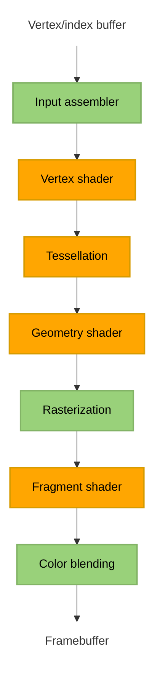

# Chapter 2.1 setting up Vulkan

## General ideas
Program starts with initiating all required Vulkan (and GLFW) objects in the **initVulkan** function, we then enter the **mainloop** function to render frames until the window is closed. After that we need to deallocate the resources we've used in the **cleanup** function.

Vulkan objects can be automatically deallocated using **RAII**, smart pointers, or by implementing automatic resource management with a class's constructor/deconstructor. (Look into **pAllocator** parameter found in almost every function related to creating/destroying Vulkan object)

Vulkan technically doesn't need a window if we're only interested in off-screen rendering. Since we want a window we have to either create one ourselves using system calls or by using a library. This tutorial uses GLFW which is a cross platform library for creating and managing windows (as well as inputs). SDL2 is another option

## VkInstance
### Basics
The **VkInstance** object can be seen as the connection between the application and the Vulkan library. We need to specify details about our application and how it'll be using Vulkan.

Vulkan uses structure to pass information instead of function parameters. These structs almost always have a **pNext** entry. This void pointer can point to another structure for more information. For example **pNext** can point to extension information.

**VkInstance** needs a **VkInstanceCreateInfo** structure to be filled out, specifying optional application information (through a pointer to **VkApplicationInfo**) and required information about what extensions/layers are needed.

Once we have enough information we can create a **VkInstance** object with the **vkCreateInstance** function call. The object creation function parameters in Vulkan are usually:

- Pointer to struct with creation info
- Pointer to custom allocator callbacks (**pAllocator** discussed previously)
- Pointer to the variable that stores the handle to the new object

### Extension support
**vkCreateInstance** can throw error **VK_ERROR_EXTENSION_NOT_PRESENT** if the extensions we requested weren't available. Throwing an error and terminating makes sense if required extensions are missing, but what about optional functionality? This is why it usually makes sense to check for extension support before creating our **VkInstance** object.

The **vkEnumerateInstanceExtensionProperties** function is used to retrieve the number of supported extensions and a corresponding array of **VkExtensionProperties**. This can be used to only add optional extensions to the list of required extensions if they are actually available.

### Cleanup
The VkInstance needs to be deallocated- This is simply done with the **vkDestroyInstance** function (note that its parameters include **pAllocator** discussed previously)

## Validation layers
### Basics
The Vulkan API has almost no error checking by default. This comes from the design goal of minimal driver overhead. Validation layers is how Vulkan incorporates error checking. Validation layers are optional components that hook into Vulkan function calls to apply additional operations. For example:

- Checking the values of parameters against the specification to detect misuse
- Tracking creation and destruction of objects to find resource leaks
- Checking thread safety by tracking the threads that calls originate from
- Logging every call and its parameters to the standard output
- Tracing Vulkan calls for profiling and replaying

Validation layers can be enabled for debug builds and then disabled for release builds, completely removing the overhead once the error checking isn't needed anymore.

There are two types of validation layers, instance and device specific. instance layers check calls related to global Vulkan objects (like instances), device specific layers only check calls related to a specific GPU

### Layer support
Similarly to how supported extensions can be retrieved with **vkEnumerateInstanceExtensionProperties**, **vkEnumerateInstanceLayerProperties** does the same but for layers.

### Message callback
By default the validation layers will print debug messages to standard output. If we want to handle this ourselves we need to provide a pointer to a callback function in our program (similar to **pAllocator** but for error messages instead of memory allocation). This will also allow us to decide what kind of errors we care about.

the callback is set up by creating a debug messenger and giving it a pointer to the callback function. The **VK_EXT_debug_utils** extension gives us the debug messenger object **VkDebugUtilsMessengerEXT**. We create and later destroy **VkDebugUtilsMessengerEXT** with functions **vkCreateDebugUtilsMessengerEXT** and **DestroyDebugUtilsMessengerEXT**. These function aren't automatically loaded since they're extension functions belonging to **VK_EXT_debug_utils**. To call these functions we use proxy functions and call the **vkGetInstanceProcAddr** function to get pointers to the real **DestroyDebugUtilsMessengerEXT**/**vkCreateDebugUtilsMessengerEXT** functions.

The creation of the **VkDebugUtilsMessengerEXT** object needs an already created **VkInstance**, and the **VkDebugUtilsMessengerEXT** object needs to be deallocated before **VkInstance** is. So our debug messenger can't actually debug any issues in the **vkCreateInstance** and **vkDestroyInstance** calls. To fix this we can create a separate **VkDebugUtilsMessengerEXT** object specifically for those two function calls.

## Physical devices
The next step after the Vulkan library has been initialized through a **VkInstance**, is to look for and select graphics cards (we can select multiple).  

The graphics card that we’ll end up selecting will be stored in a **VkPhysicalDevice** handle. The graphics cards are queried through the **vkEnumeratePhysicalDevices** function that enumerates the physical devices accessible to a Vulkan instance.

If we have a **VkPhysicalDevice** handle corresponding to an available graphics card, we can use different functions to query different information about the graphics card.

- **vkGetPhysicalDeviceProperties**: Get basic device properties like the name, type and supported Vulkan version
- **vkGetPhysicalDeviceFeatures**: Get the support for optional features like texture compression, 64 bit floats and
multi viewport rendering (useful for VR)
- **vkGetPhysicalDeviceQueueFamilyProperties**: Get a list of queue families and the number of queues of each queue family.

### Queue families
Almost every operation in Vulkan requires commands to be submitted to the GPU, this is done through queues. The queue families of a GPU are groups of queues that support the same operations. For example, the GPU can have a queue family **A** consisting of **x** queues supporting the same **n** operations, and a different queue family **B** consisting of **y** queues all supporting the same **m** operations different from queue family **A**.

## Logical devices
After we have picked a physical device we need to set up a logical device to interface with it. We need to specify some properties for our logical device and set up what device features and queues we're gonna use. The queues are automatically created along with the logical device, but we need a handle to interface with them, this is done through **VkQueue**.

# Chapter 2.2 Presentation
To make a connection between Vulkan and the window system on your system you need to use the WSI (Window System Integration) extensions. These extensions are used so often that the standard Vulkan loader often includes the extension's functions, so we don't need to explicitly load them like we had for **DestroyDebugUtilsMessengerEXT** and **vkCreateDebugUtilsMessengerEXT**.

## Window surface
The **VK_KHR_surface** extension exposes the **VkSurfaceKHR** object that represents a surface to present images to. **VkSurfaceKHR** needs to be setup right after the **VkInstance** because creation of the surface can influence the device selection. Window surfaces are an entirely optional component in Vulkan, so we went through a bare bones setup without on-screen rendering in **2.1**. This chapter is focused on adding functionality for presenting to the screen.

Creating the **VkSurfaceKHR** object depends on what system you're on. In our case, GLFW will handle any  platform specific implementation so we just call the **glfwCreateWindowSurface** function. Remember that the **VkSurfaceKHR** object needs to be deallocated before the **VkInstance**.

We also need to make sure that our physical device supports presenting to the screen, so we need a physical device with a queue family that supports presenting. Support for presentation isn't checked with the **vkGetPhysicalDeviceQueueFamilyProperties** function, but rather **vkGetPhysicalDeviceSurfaceSupportKHR** that for every queue family queries if presentation support exists. Ideally we'd want to support both graphics operations (that we already needed) and presenting in the same queue family, so that we only need one queue. In the tutorial we don't assume this to be the case so we make another **VkQueue** handle to interface with the presentation queue. The two **VkQueue** handles point to the same underlying queue on my machine.

## Swap chain
Swap chains can be seen as an array of presentable images waiting to be presented to the screen. One image is displayed at a time, but multiple images can be queued for presentation. An application can acquire the use of a presentable image, draw to it, and then present the image back to the swap chain. The general purpose of the swap chain is to synchronize the presentation of images with the refresh rate of the screen.

Before you can create a swap chain you need to check for and enable the device extension for it. Actually, our device having a presentation queue implies that the swap chain extension must be supported, but it's good to be explicit about what functionality we're looking for. After confirming availability, the extension then needs to be enabled during the creation of the logical device.

Next we need to check if the swap chain is compatible with our window surface, we use several functions to query the capabilities of the surface.
- **vkGetPhysicalDeviceSurfaceCapabilitiesKH**:
- **vkGetPhysicalDeviceSurfaceFormatsKHR**:
- **vkGetPhysicalDeviceSurfacePresentModesKHR**

For this tutorial swap chain support is sufficient if there is at least one supported image
format and one supported presentation mode given our window surface.

Support is now sufficient for creating a swap chain. Since we only required the bare minimum support, there might still be many different modes of varying optimality. So when creating our swapchain we pick our preferred settings out of what is available.

After the swap chain has been created we need new **VkImage** handles to handle the images in the swap chain

## Image views
The **VkImage** object holds the data for the image but it doesn't contain a lot of information on how to read it. To use any **VkImage** in a render pipeline we have to create a **VkImageView** object. The **VkImageView** describes how to access the image and which part of
the image to access.

So to enable us to use the images in our swap chain, we need to create a **VkImageView** for every one of those images.

# Chapter 2.3 Graphics pipeline basics
## Introduction
The graphics pipeline is a sequence of operations that take the vertices and textures of your meshes all the
way to the pixels in the render targets. A simple overview of the sequence looks like

Nodes in green are fixed-function stages, you have some ability to change how operations are performed, but the way they work is mostly predefined. Nodes in orange are programmable, we upload our own code to the graphics card, applying exactly the operations we want.

A short description of each step in the sequence:

**Input assembler** - Collects the raw vertex data from specified buffers and assembles them into primitives.

**Vertex shader** - The **Vertex shader** is run for every vertex and generally applies transformations to turn vertex position from model space to screen space.

**Tessellation (optional)** - Uses tessellation shaders to subdivide geometry based on certain rules to increase the mesh quality.

**Geometry shader (optional)** - The **Geometry shader** is run for every primitive and can discard or output more primitives than came in. This is similar to the tessellation shader, but much more flexible. Example usage is modeling hair/fur defined by lines, the **Geometry shader** is then used to turn the lines into something with a surface (that can be drawn).

**Rasterization** - Converts each primitive into a set of fragments. A fragment is the data necessary to generate a single pixel's worth of a primitive (it will be what the framebuffer is filled with). Fragments that fall outside the screen (or behind other fragments) are discarded.

**Fragment shader** - The **fragment shader** is invoked for every fragment that survives and determines which framebuffer(s) the fragments are written to and with which color and depth values.

**Color blending** - applies operations to different fragments that map to the same pixel in the framebuffer.  Fragments can simply overwrite each other, add up or be mixed based upon transparency. I would guess that this can be used to represent effects like looking through a window.

The graphics pipeline in Vulkan can't (for the most part) be changed after it's created. If you want a different setup you'd have to create a new pipeline. The disadvantage of immutable pipelines is that it necessitates a lot of pipelines that cover all of our use cases. The advantage is that the driver can optimize for the pipelines better, since all the pipelines are known in advance.

