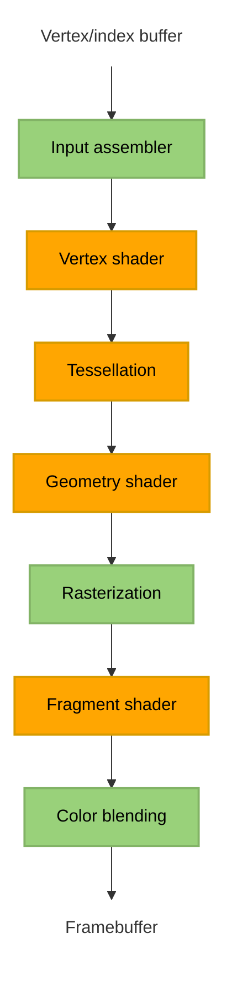

The setup wasn't really noteworthy so that's why the notes start where they do. In reality "Drawing a triangle" is chapter 4 in the tutorial, but I consider the "Introduction", "Overview" and "Development environment" chapters to all be setup. So to me, chapter 1 is all the setup to begin working with Vulkan, and chapter 2 consists of the entire "Drawing a triangle" chapter.

# Chapter 2 Drawing a triangle
## Chapter 2.1 setting up Vulkan

### General ideas
Program starts with initiating all required Vulkan (and GLFW) objects in the **initVulkan** function, we then enter the **mainloop** function to render frames until the window is closed. After that we need to deallocate the resources we've used in the **cleanup** function.

Vulkan objects can be automatically deallocated using **RAII**, smart pointers, or by implementing automatic resource management with a class's constructor/deconstructor. (Look into **pAllocator** parameter found in almost every function related to creating/destroying Vulkan object)

Vulkan technically doesn't need a window if we're only interested in off-screen rendering. Since we want a window we have to either create one ourselves using system calls or by using a library. This tutorial uses GLFW which is a cross platform library for creating and managing windows (as well as inputs). SDL2 is another option

### VkInstance
#### Basics
The **VkInstance** object can be seen as the connection between the application and the Vulkan library. We need to specify details about our application and how it'll be using Vulkan.

Vulkan uses structure to pass information instead of function parameters. These structs almost always have a **pNext** entry. This void pointer can point to another structure for more information. For example **pNext** can point to extension information.

**VkInstance** needs a **VkInstanceCreateInfo** structure to be filled out, specifying optional application information (through a pointer to **VkApplicationInfo**) and required information about what extensions/layers are needed.

Once we have enough information we can create a **VkInstance** object with the **vkCreateInstance** function call. The object creation function parameters in Vulkan are usually:

- Pointer to struct with creation info
- Pointer to custom allocator callbacks (**pAllocator** discussed previously)
- Pointer to the variable that stores the handle to the new object

#### Extension support
**vkCreateInstance** can throw error **VK_ERROR_EXTENSION_NOT_PRESENT** if the extensions we requested weren't available. Throwing an error and terminating makes sense if required extensions are missing, but what about optional functionality? This is why it usually makes sense to check for extension support before creating our **VkInstance** object.

The **vkEnumerateInstanceExtensionProperties** function is used to retrieve the number of supported extensions and a corresponding array of **VkExtensionProperties**. This can be used to only add optional extensions to the list of required extensions if they are actually available.

#### Cleanup
The VkInstance needs to be deallocated- This is simply done with the **vkDestroyInstance** function (note that its parameters include **pAllocator** discussed previously)

### Validation layers
#### Basics
The Vulkan API has almost no error checking by default. This comes from the design goal of minimal driver overhead. Validation layers is how Vulkan incorporates error checking. Validation layers are optional components that hook into Vulkan function calls to apply additional operations. For example:

- Checking the values of parameters against the specification to detect misuse
- Tracking creation and destruction of objects to find resource leaks
- Checking thread safety by tracking the threads that calls originate from
- Logging every call and its parameters to the standard output
- Tracing Vulkan calls for profiling and replaying

Validation layers can be enabled for debug builds and then disabled for release builds, completely removing the overhead once the error checking isn't needed anymore.

There are two types of validation layers, instance and device specific. instance layers check calls related to global Vulkan objects (like instances), device specific layers only check calls related to a specific GPU

#### Layer support
Similarly to how supported extensions can be retrieved with **vkEnumerateInstanceExtensionProperties**, **vkEnumerateInstanceLayerProperties** does the same but for layers.

#### Message callback
By default the validation layers will print debug messages to standard output. If we want to handle this ourselves we need to provide a pointer to a callback function in our program (similar to **pAllocator** but for error messages instead of memory allocation). This will also allow us to decide what kind of errors we care about.

the callback is set up by creating a debug messenger and giving it a pointer to the callback function. The **VK_EXT_debug_utils** extension gives us the debug messenger object **VkDebugUtilsMessengerEXT**. We create and later destroy **VkDebugUtilsMessengerEXT** with functions **vkCreateDebugUtilsMessengerEXT** and **DestroyDebugUtilsMessengerEXT**. These function aren't automatically loaded since they're extension functions belonging to **VK_EXT_debug_utils**. To call these functions we use proxy functions and call the **vkGetInstanceProcAddr** function to get pointers to the real **DestroyDebugUtilsMessengerEXT**/**vkCreateDebugUtilsMessengerEXT** functions.

The creation of the **VkDebugUtilsMessengerEXT** object needs an already created **VkInstance**, and the **VkDebugUtilsMessengerEXT** object needs to be deallocated before **VkInstance** is. So our debug messenger can't actually debug any issues in the **vkCreateInstance** and **vkDestroyInstance** calls. To fix this we can create a separate **VkDebugUtilsMessengerEXT** object specifically for those two function calls.

### Physical devices
The next step after the Vulkan library has been initialized through a **VkInstance**, is to look for and select graphics cards (we can select multiple).  

The graphics card that we’ll end up selecting will be stored in a **VkPhysicalDevice** handle. The graphics cards are queried through the **vkEnumeratePhysicalDevices** function that enumerates the physical devices accessible to a Vulkan instance.

If we have a **VkPhysicalDevice** handle corresponding to an available graphics card, we can use different functions to query different information about the graphics card.

- **vkGetPhysicalDeviceProperties**: Get basic device properties like the name, type and supported Vulkan version
- **vkGetPhysicalDeviceFeatures**: Get the support for optional features like texture compression, 64 bit floats and
multi viewport rendering (useful for VR)
- **vkGetPhysicalDeviceQueueFamilyProperties**: Get a list of queue families and the number of queues of each queue family.

#### Queue families
Almost every operation in Vulkan requires commands to be submitted to the GPU, this is done through queues. The queue families of a GPU are groups of queues that support the same operations. For example, the GPU can have a queue family **A** consisting of **x** queues supporting the same **n** operations, and a different queue family **B** consisting of **y** queues all supporting the same **m** operations different from queue family **A**.

### Logical devices
After we have picked a physical device we need to set up a logical device to interface with it. We need to specify some properties for our logical device and set up what device features and queues we're gonna use. The queues are automatically created along with the logical device, but we need a handle to interface with them, this is done through **VkQueue**.

## Chapter 2.2 Presentation
To make a connection between Vulkan and the window system on your system you need to use the WSI (Window System Integration) extensions. These extensions are used so often that the standard Vulkan loader often includes the extension's functions, so we don't need to explicitly load them like we had for **DestroyDebugUtilsMessengerEXT** and **vkCreateDebugUtilsMessengerEXT**.

### Window surface
The **VK_KHR_surface** extension exposes the **VkSurfaceKHR** object that represents a surface to present images to. **VkSurfaceKHR** needs to be setup right after the **VkInstance** because creation of the surface can influence the device selection. Window surfaces are an entirely optional component in Vulkan, so we went through a bare bones setup without on-screen rendering in **2.1**. This chapter is focused on adding functionality for presenting to the screen.

Creating the **VkSurfaceKHR** object depends on what system you're on. In our case, GLFW will handle any  platform specific implementation so we just call the **glfwCreateWindowSurface** function. Remember that the **VkSurfaceKHR** object needs to be deallocated before the **VkInstance**.

We also need to make sure that our physical device supports presenting to the screen, so we need a physical device with a queue family that supports presenting. Support for presentation isn't checked with the **vkGetPhysicalDeviceQueueFamilyProperties** function, but rather **vkGetPhysicalDeviceSurfaceSupportKHR** that for every queue family queries if presentation support exists. Ideally we'd want to support both graphics operations (that we already needed) and presenting in the same queue family, so that we only need one queue. In the tutorial we don't assume this to be the case so we make another **VkQueue** handle to interface with the presentation queue. The two **VkQueue** handles point to the same underlying queue on my machine.

### Swap chain
Swap chains can be seen as an array of presentable images waiting to be presented to the screen. One image is displayed at a time, but multiple images can be queued for presentation. An application can acquire the use of a presentable image, draw to it, and then present the image back to the swap chain. The general purpose of the swap chain is to synchronize the presentation of images with the refresh rate of the screen.

Before you can create a swap chain you need to check for and enable the device extension for it. Actually, our device having a presentation queue implies that the swap chain extension must be supported, but it's good to be explicit about what functionality we're looking for. After confirming availability, the extension then needs to be enabled during the creation of the logical device.

Next we need to check if the swap chain is compatible with our window surface, we use several functions to query the capabilities of the surface.
- **vkGetPhysicalDeviceSurfaceCapabilitiesKH**
- **vkGetPhysicalDeviceSurfaceFormatsKHR**
- **vkGetPhysicalDeviceSurfacePresentModesKHR**

For this tutorial swap chain support is sufficient if there is at least one supported image
format and one supported presentation mode given our window surface.

Support is now sufficient for creating a swap chain. Since we only required the bare minimum support, there might still be many different modes of varying optimality. So when creating our swapchain we pick our preferred settings out of what is available (something to revisit is how to handle swap chain images that will be used across multiple queue families). After the swap chain has been created we need new **VkImage** handles to the images in the swap chain

### Image views
The **VkImage** object holds the data for the image but it doesn't contain a lot of information on how to read it. To use any **VkImage** in a render pipeline we have to create a **VkImageView** object. The **VkImageView** describes how to access the image and which part of the image to access. So to enable us to use the images in our swap chain, we need to create a **VkImageView** for every one of those images.

## Chapter 2.3 Graphics pipeline basics
### Introduction
The graphics pipeline is a sequence of operations that take the vertices and textures of your meshes all the way to the pixels in the render targets. A simple overview of the sequence looks like

Nodes in green are fixed-function stages, you have some ability to change how operations are performed, but the way they work is mostly predefined. Nodes in orange are programmable, we upload our own code to the graphics card, applying exactly the operations we want.

A short description of each step in the sequence:

**Input assembler** - Collects the raw vertex data from specified buffers and assembles them into primitives.

**Vertex shader** - The **Vertex shader** is run for every vertex and generally applies transformations to turn vertex position from model space to screen space.

**Tessellation (optional)** - Uses tessellation shaders to subdivide geometry based on certain rules to increase the mesh quality.

**Geometry shader (optional)** - The **Geometry shader** is run for every primitive and can discard or output more primitives than came in. This is similar to the tessellation shader, but much more flexible. Example usage is modeling hair/fur defined by lines, the **Geometry shader** is then used to turn the lines into something with a surface (that can be drawn).

**Rasterization** - Converts each primitive into a set of fragments. A fragment is the data necessary to generate a single pixel's worth of a primitive (it will be what the framebuffer is filled with). Fragments that fall outside the screen (or behind other fragments) are discarded.

**Fragment shader** - The **fragment shader** is invoked for every fragment that survives and determines which framebuffer(s) the fragments are written to and with which color and depth values.

**Color blending** - applies operations to different fragments that map to the same pixel in the framebuffer.  Fragments can simply overwrite each other, add up or be mixed based upon transparency. I would guess that this can be used to represent effects like looking through a window.

The graphics pipeline in Vulkan can't (for the most part) be changed after it's created. If you want a different setup you'd have to create a new pipeline. The disadvantage of immutable pipelines is that it necessitates a lot of pipelines that cover all of our use cases. The advantage is that the driver can optimize for the pipelines better, since all the pipelines are known in advance.

### Shader modules
(**Tessellation** and **geometry shaders** aren't covered)

Shader code in vulkan has to be in the bytecode format **SPIR-V**. Writing bytecode manually is tiresome, luckily there are compilers that compiles **GLSL** (high-level shading language created by OpenGL) to **SPIR-V**. We write both our **Vertex shader** and **Fragment shader** in **GLSL** and compile them into **SPIR-V** binaries.

To pass the shaders to a pipeline, we have to load the binaries and wrap them into **VkShaderModule** objects. We also need to give information about what pipeline stage a **VkShaderModule** object belongs to, which is done through the **VkPipelineShaderStageCreateInfo** struct (**pSpecializationInfo** member in the struct is skipped but worth remembering). 

### Fixed functions
The other stages of the pipeline aren't programmable, but we still need to configure the state of these stages along with anything else that needs to be configured.

#### Setting state through **CreateInfo** structs
Setting the state of the pipeline involves configuring a lot of **CreateInfo** structs,

**Vertex input state**: Specifies the format
of the vertex data that will be passed to the vertex shader, uses the **VkPipelineVertexInputStateCreateInfo** struct.

**Input assembly state**: Specifies what kind of geometry will be drawn from the vertices and if primitive restart (?) should be enabled, uses the **VkPipelineInputAssemblyStateCreateInfo** struct.

**Viewport and scissor state**: Specifies the region of the framebuffer that the output will
be rendered to, uses the **VkPipelineViewportStateCreateInfo** struct.

**Rasterizer state**: Specify how the rasterizer turns geometry that is shaped by the vertices from the vertex shader into fragments to be colored by the fragment shader, uses the **VkPipelineRasterizationStateCreateInfo** struct.

**Multisampling state**: Configure multisampling. Uses the **VkPipelineMultisampleStateCreateInfo** struct. (will revisit multisampling later).

**Depth and stencil testing state**: configure
the depth and stencil tests. Uses the  **VkPipelineDepthStencilStateCreateInfo** structs. (will revisit Depth and stencil testing later).

**Color blending state**: Specifies how color blending will be done, uses the **VkPipelineColorBlendStateCreateInfo** struct.

#### Dynamic state
While most of the pipeline's state is baked into an immutable pipeline state object, there is a limited amount of the state that can be changed without recreating the pipeline. Examples are,

- Size of the viewport
- Line width
- Blend constants

You either configure these and bake them into the immutable pipeline state object, or set up the use of dynamic state. If dynamic state is used for the size of the viewport, it'll cause the configuration of the viewport size to be ignored during pipeline creation, and you'll need to specify this data during drawing time instead. Using dynamic state can result in a more flexible setup and is common for viewport and scissor state. Setting up dynamic state uses **VkPipelineDynamicStateCreateInfo**.

### Pipeline layout
Similar to how dynamic state allows us to change some state at draw time, we can use uniform values in shaders to alter the behavior of shaders without having to recreate them. The uniform values (and push values) need to be specified during pipeline creation by creating a **VkPipelineLayout** object. Even if we aren't using this functionality, a **VkPipelineLayout** object is still required for creating a graphics pipeline so we need to at least create an empty pipeline layout. We'll refer to the the pipeline layout from other functions later, so we create a class member to store it.

### Render pass
When rendering, we render to a framebuffer, containing a set of attachments. There are different types of attachments like color and depth attachments, each represented by a **VkImageView** object. For example, a framebuffer that has both a color and depth attachments (so 2 **VkImageView** objects) can be used for basic 3D rendering.

Before we can use the pipline we need to define the behavior and lifecycle of the attachments during a rendering process, this is the role of the **VkRenderPass** object. We need to specify,

- how many attachments, and of what types?
- what to do with data in attachments before/after rendering
- Initial/Final layout
- subpasses (only quickly mentioned but seems more important as project grows)

After these have been specified we can create our **VkRenderPass** object.

### Conclusion (creating pipeline)
We're now ready to create our graphics pipeline. We just need to combine all of the structures and objects from this chapter (Chapter 2.3 Graphics pipeline basics), together they fully define the functionality of the graphics pipeline. Things of note for the creation process of the **VkPipeline** object,

- deriving from existing pipelines (it is less expensive to set up pipelines when they have much functionality in common with an existing pipeline and switching between pipelines from the same parent can also be done quicker.)
- **vkCreateGraphicsPipelines** has more parameters compared to usual object creation functions in Vulkan. This is partially because it's  designed to take multiple **VkGraphicsPipelineCreateInfo** objects and create multiple **VkPipeline** objects in a single call. additionally the pipeline cache (not covered yet).

## Chapter 2.4 Drawing

### Framebuffers
It has been mentioned that the render targets in Vulkan are Framebuffers, each consisting of a one or more attachments represented by **VkImageView** objects. We've setup the render pass to expect a single framebuffer with the same format as the swap chain images, and to only expect a framebuffer with one color attachment. The image we have to use for a particular render pass depends on which image the swap chain returns when we retrieve one for presentation. This means that we need to create a framebuffer for every image in the swap chain so we can render to the one that corresponds to the retrieved image.

Every framebuffer is a **VkFramebuffer** object, so we'll make an array of them (similar to how we created **VkImageView** objects). For creation of each **VkFramebuffer** object we need to specify which render pass it has to be compatible with. Every attachments needs to be specified, each with a corresponding **VkImageView** object. Lastly we need to define the dimensions of the framebuffer.

### Command buffers
In Vulkan, all GPU commands (with a few exceptions) have to go through a **VkCommandBuffer** object. Command buffers creation is done through the use of a **VkCommandPool** object. One command pool is designed to be used by a single thread and manages the allocation/deallocation of command buffers within the same queue family. Creating a **VkCommandPool** is simple, just specify the queue family index and any additional flags. Once the **VkCommandPool** has been created, **VkCommandBuffer** objects can easily be made.

with a **VkCommandBuffer** object we can record a sequence of commands. For example a basic draw sequence
- Begin render pass
- Bind to pipeline
- Draw to Image
- End render pass
When the commands have been recorded into the command buffer, they can be submitted to the  queue for execution.

### Rendering and presentation
Now everything is setup to implement a **drawFrame** function. The basic steps for the **drawFrame** are

- Wait for previous frame to finish
- Acquire an image from the swap chain
- Record a command buffer which draws the scene onto that image
- Submit the recorded command buffer
- Present the swap chain image

This implementation is basic suboptimal. We'll expand on the **drawFrame** later.

#### Synchronization
Operations on the GPU in vulkan are automatically parallelized to a large extent. Loosely speaking, once we submit a command buffer the GPU will execute a lot of operations in parallel, without any consideration for synchronization. This is powerful because it allows the GPU to focus on what it does best, but a consequence is that we have to implement synchronization where an explicit order is important (for example, where results from some operations depend on other (potentially unfinished) operations).

For our basic implementation of the **drawFrame** function there are 3 events that need to be synchronized,

- Acquire an image from the swap chain
- Execute commands that draw onto the acquired image
- Present that image to the screen for presentation, returning it to the
swapchain

Each of these events are set in motion using a single function call, but they're all executed asynchronously on the GPU. The function calls themselves will return almost immediately, before the operations are actually finished on the GPU. Since each of our events depend on the previous one finishing, we need some way of achieving our desired ordering, luckily Vulkan provides primitives for that exact purpose. Similarly to how semaphores are used to synchronize multithreaded applications, Vulkan provides primitives **VkSemaphore** and **VkFence** for synchronization. **VkSemaphore** is used to synchronize work between GPU commands (for example, synchronizing execution of two GPU operations) and **VkFence** is used to synchronize between GPU and CPU (for example, when the CPU needs to know whether a set of GPU operations has completed). **VkFence** actually does block host execution so use it sparingly.

#### Subpass dependencies
Even though we only use 1 subpass, the operations right before and right after our subpass count as implicit “subpasses” and require some implementation to synchronize. I'll have to read more about subpass dependency, the tutorial doesn't go into enough details.

#### Presentation
Adding everything mentioned in this section together, we're finally able to draw our triangle.

### Frames in flight
One of the flaws with our current basic drawing function, is that we wait for the previous frame to finish before we start rendering the next. To get rid of this unnecesssary idling we can allow multiple frames to be *in-flight* at once. You don't want to many frames *in-flight* because then the CPU could get ahead of the GPU, adding frames of latency.

Adding this functionality isn't to complicated, you just need to keep track of the current frame, and for each of these frames, duplicate all the resources that are accessed/modified during rendering. Each frame needs its own, Command buffer, semaphores and fence. 

## 2.5 Swap chain recreation

### Introduction
The application can now successfully draw a triangle, but before moving on to the next chapter lets make it so that our application can handle changes to the surface. Right now, it's possible for the window surface to change such that the swap chain is no longer compatible with it (an example of this would be minimizing the window). To fix this, we need to catch events that change the window surface and recreate the swap chain.

### Recreating the swap chain
First let's implement a function for recreating the swap chain. Not only do we need to recreate the swap chain, but we also need to recreate objects that depend on either the swap chain or the window size. This includes the **VkSwapchainKHR**, **VkImageView**, and **VkFramebuffer** objects (**VkRenderPass** would also need to be recreated if the swapchain image format changed, but we skip it. Unclear if this would also necessitate recreation of the VkPipeline). The general outline of a **recreateSwapChain** function is

1. Wait if resources are still being used.
2. Clean up objects before recreating them
3. Recreate objects
   
("A disadvantage of this approach is that we need to stop all rendering before creating a new swap chain. It is possible to create a new swap chain while drawing commands on an image from the old swap chain are still in-flight. You need to pass the previous swap chain to the oldSwapChain field in the VkSwapchainCreateInfoKHR struct and destroy the old swap chain as soon as you’ve finished using it.")

### Suboptimal or out-of-date swap chain
The next step is to figure out when to actually recreate the swap chain. Vulkan usually tells us that the swap chain is no longer adequate during presentation. The return values of **vkAcquireNextImageKHR** and **vkQueuePresentKHR** can indicate (among other things) whether or not the swap chain is still compatible. For this there are 2 relevant return values.

- **VK_SUBOPTIMAL_KHR**: The swap chain has become incompatible with the surface and can no longer be used for rendering.
- **VK_ERROR_OUT_OF_DATE_KHR**: The swap chain can still be used to successfully present to the surface, but the surface properties are no longer matched exactly.

After a **vkAcquireNextImageKHR** call, you could recreate the swap chain for both **VK_SUBOPTIMAL_KHR** and **VK_ERROR_OUT_OF_DATE_KHR** return values. However, you can still proceed normally with a suboptimal swap chain. Since the next image has already been acquired it can make sense to only recreate the swap chain when necessary (i.e when getting **VK_ERROR_OUT_OF_DATE_KHR**).

After a **vkQueuePresentKHR** call we don't need to worry about already acquiring an image, so we can simply recreate the swap chain if we get either **VK_SUBOPTIMAL_KHR** or **VK_ERROR_OUT_OF_DATE_KHR**.

### Fixing a deadlock
A very important thing you might notice is that currently swap chain recreation can cause a deadlock. When **vkAcquireNextImageKHR** returns **VK_ERROR_OUT_OF_DATE_KHR** we recreate the swap chain and return from **drawFrame**. **vkQueueSubmit** is never called and consequently the current frame's **VkFence** will never get signaled, causing the **vkWaitForFences** call at the start of the next **drawFrame** to wait forever. Luckily there is a simple fix, simply wait to reset the fence until we know whether or not we'll be continue through **drawFrame**.

### Handling resizes explicitly
Ideally, all drivers and platforms would trigger VK_ERROR_OUT_OF_DATE_KHR automatically after a window resize, but this is not a guarantee. Because of this we'll handle resizes explicitly. This involves using the **glfwSetFramebufferSizeCallback** function to setup a callback function that's gets called whenever our **GLFWwindow** is resized.

("It is important to do this after vkQueuePresentKHR to ensure that the semaphores are in a consistent state, otherwise a signaled semaphore may never be properly waited upon.")

### Handling minimization
Lastly we will consider a special kind of window resizing, that being window minimization. This special case results in a frame buffer of size 0. We'll handle a framebuffer of size 0 by simply pausing until the window is no longer minimized (Not really a good solution?).

# Chapter 3 Vertex buffers
The upcoming chapters are a lot shorter compared to chapter 2, so we don't need to divide the notes into as many subsections.

This chapter is about replacing the hardcoded vertex data that we're currently using, with a vertex buffer in memory.

"We’ll start with the easiest approach of creating a CPU visible buffer and using memcpy to copy the vertex data into it directly, and after that we’ll see how to use a staging buffer to copy the vertex data to high performance memory"

## 3.1 Vertex input description
First we remove the vertex data from our **shader.vert** file. Instead, to take input from a vertex buffer we use the **in** keyword. When using the **in** keyword, we need to specify what vertex attributes we are taking as an input, and how they are placed within the buffer. In our case we have 2 vertex attributes, **inPosition** and **inColor**. Using the **layout(location = x)** annotations we're also able to assign indices to the inputs (**inPosition** at index 0 and **inColor** index 1). Each vertex attribute can be seen as properties that are specified per-vertex in the vertex buffer.

"It is important to know that some types, like **dvec3** 64 bit vectors, use multiple slots. That means that the index after it must be at least 2 higher"

Next we simply create a **Vertex** structure in the code of our program with the two attributes that we’re going to use in the vertex shader. We can use this structure to create an array of vertex data that can be uploaded into GPU memory.

Once the vertex data has been uploaded to GPU memory, we also need to tell Vulkan how to pass this data to the vertex shader. Two structures are used to convey this information,

**VkVertexInputBindingDescription**: Describes at which rate to load data from memory throughout the vertices. It specifies,
- A **binding** parameter describing the index of this binding in the array of bindings (we only have 1).
- A **stride** parameter describing the number of bytes between data entries (vertices in our case).
- A **inputRate** parameter describing whether to move to the next data entry after each vertex or each instance.

**VkVertexInputAttributeDescription**: Describes how to extract a vertex attribute from vertex data originating from a binding description. We'll need two of these structures, one for **inPosition** and another for **inColor**. Each structure specifies,
- A **binding** parameter describing which binding the per-vertex data comes (we only have 1).
- A **location** parameter describing the location of the attribute in the vertex shader.
- A **format** parameter describing the size and type of the vertex attribute data.
- A **offset** parameter describing the number of bytes of this attribute relative to the start of the per-vertex data.

The graphics pipeline needs to be setup to accept vertex data in this format by referencing the **VkVertexInputBindingDescription** and **VkVertexInputAttributeDescription** structures during its creation. This is done through the **vertexInputInfo** struct.

## 3.2 Vertex buffer creation
If we tried running our program after 3.1 we'd get an error because there is no vertex buffer bound to our binding. We need to create a vertex buffer and move the vertex data to it so the GPU is able to access it.

Buffers in vulkan are regions of memory used for storing arbitrary data that can be read by the graphics card, the vertex buffer is simply a buffer storing vertex data. **VkBuffer** is the Vulkan object used for buffers, creation and cleanup is similar to most Vulkan objects. For creation we fill out a **VkBufferCreateInfo**, and we have to make sure to deallocate the resources during cleanup.

Unlike most other Vulkan objects the **VkBuffer** doesn't automatically allocate memory to itself. We'll need to use a **VkDeviceMemory** object as a handle to the memory and use **vkAllocateMemory** to allocate device memory. After successfully allocating memory, we need to associate it with the buffer using **vkBindBufferMemory**. (don't forget this allocated device memory needs to be freed separately from the **VkBuffer**). Lastly we copy the vertex data to the buffer and modify the rendering operations to use the vertex buffer.

## 3.3 Staging buffer
Our current setup uses a memory type with the **VK_MEMORY_PROPERTY_HOST_VISIBLE_BIT** and **VK_MEMORY_PROPERTY_HOST_COHERENT_BIT** flags. The **VK_MEMORY_PROPERTY_HOST_VISIBLE_BIT** flag indicates that the allocated memory can be mapped into the application’s address space, meaning it is accessible from the CPU. The **VK_MEMORY_PROPERTY_HOST_COHERENT_BIT** flag indicates that memory is coherent between the host (CPU) and the device (GPU) automatically. This means any writes to this memory from the CPU are visible to the GPU without needing to explicitly flush the cache, and reads by the CPU are also automatically coherent. This memory type is not the most optimal memory type for access by the GPU. Instead we want the **VK_MEMORY_PROPERTY_DEVICE_LOCAL_BIT** flag which indicates that the memory is optimized for access by the GPU, typically residing in VRAM or high-performance GPU memory. This flag is usually mutually exclusive with **VK_MEMORY_PROPERTY_HOST_VISIBLE_BIT** and **VK_MEMORY_PROPERTY_HOST_COHERENT_BIT** flags, so it isn't accessible by the CPU. To use this memory we have to use 2 vertex buffers, a staging buffer in CPU accessible memory that we can upload the vertex data to, and a buffer in device local memory. We'll then use a buffer copy command to get the data from the staging buffer to our 'real' vertex buffer.

A queue family that supports transfer operations is reqired for the buffer copy command, luckly any queue family with the graphics or compute capabilities (**VK_QUEUE_GRAPHICS_BIT** or **VK_QUEUE_COMPUTE_BIT** flags) implicitly support transfer operations (**VK_QUEUE_TRANSFER_BIT** flag) so we don't need to worry about it. 

We generalize buffer creation since we're using multiple different buffers. Then when we create our 2 buffers we need 2 new buffer usage flags, **VK_BUFFER_USAGE_TRANSFER_SRC_BIT** for staging buffer and **VK_BUFFER_USAGE_TRANSFER_DST_BIT** for buffer on device local memory. The stage buffer can be allocated in the same way as before, using **vkMapMemory** but we aren't going to be able to use that for our device local vertex buffer. This is where we'll use the transfer operations disscused previously to copy data from the staging buffer to our 'real' vertex buffer. 

Memory transfer operations are executed using command buffers, just like drawing commands. The steps look something like,
1. Create command buffer
2. Record command to copy stage buffer to vertex buffer on device local memory.
3. submit work to queue for transfer capabilities
4. Wait for it to be done
5. Deallocate command buffer
6. Deallocate staging buffer

Optimizations to consider,
- "You may wish to create a separate command pool for these kinds of short-lived buffers, because the implementation may be able to apply memory allocation optimizations"
- "We could use a fence and wait with vkWaitForFences, or simply wait for the transfer queue to become idle with vkQueueWaitIdle. A fence would allow you to schedule multiple transfers simultaneously and wait for all of them complete, instead of executing one at a time. That may give the driver more opportunities to optimize."
- "It should be noted that in a real world application, you’re not supposed to actually call vkAllocateMemory for every individual buffer. The maximum number of simultaneous memory allocations is limited by the maxMemoryAllocationCount physical device limit, which may be as low as 4096 even on high end hardware like an NVIDIA GTX 1080. The right way to allocate memory for a large number of objects at the same time is to create a custom allocator that splits up a single allocation among many different objects by using the offset parameters that we’ve seen in many functions."

## 3.4 Index buffer
Imagine we want to make a rectangle, we would need 2 triangles that share 2 vertices. To avoid redundancy we can specify vertices only once and use an index buffer to specify what vertices make up a triangle. The setup for the index buffer is almost identical to that of the vertex buffer that we've done in 3.2 and 3.3, the differences being **bufferSize** and usage of the **VK_BUFFER_USAGE_INDEX_BUFFER_BIT** instead of the **VK_BUFFER_USAGE_VERTEX_BUFFER_BIT** flag. Aside from that you also need to change what's recorded to the command buffer when drawing, binding the index buffer and using **vkCmdDrawIndexed** instead of **vkCmdDraw**.

# Chapter 4 Uniform buffers
## 4.1 Descriptor layout and buffer
Only using a vertex buffer is limited. If we want some global data how would we accomplish that? For example, 3D graphics require a model-view-projection transformation matrix to transform a vertex from model space to clip space. Every vertex needs to be transformed using this matrix, how do we implement that? Adding the matrix to vertex data would waste a lot of memory, since the matrix would need to be copied for each vertex. Additionally the transformation matrix can change up to every frame, so we probably want a single location for the matrix (so changes to the matrix only need to be done in a single location).

The way to solve this problem in Vulkan is by using resource descriptors, which allows shaders to freely access resources like buffers and images. There are many types of descriptors, we'll be using uniform buffer objects (UBO) because uniform buffers are great for small, read only data (in reality Push constants are better than descriptors for small, fast-updating data but this isn't covered in the tutorial). To implement this we first need to,

1.  Update the vertex shader to include the UBO
2.  Specify a descriptor layout during pipeline creation
	- "The descriptor layout specifies the types of resources that are going to be accessed by the pipeline, just like a render pass specifies the types of attachments that will be accessed."
3.  Set up uniform buffers that contain the transformation matrices.
	- "We should have multiple buffers, because multiple frames may be in flight at the same time and we don’t want to update the buffer in preparation of the next frame while a previous one is still reading from it! Thus, we need to have as many uniform buffers as we have frames in flight, and write to a uniform buffer that is not currently being read by the GPU"
	- A uniform buffer will be updated every frame so aside from creating the buffers we also need to implement a function to update a buffer every frame. Because of this, we won't be using device local memory for the buffers since we're updating a buffer every frame, it would just create too much overhead (create new or update stage buffer and copy stage buffer to buffer on device local memory). Instead, to update the uniform buffers we never call **vkUnmapMemory** after mapping the uniform buffers with **vkMapMemory** (this is called persistent mapping). The buffers stay mapped for the application’s whole lifetime.

## 4.2 Descriptor pool and sets
The descriptor layout only describes the type of descriptors that can be bound, we also need to create a descriptor set during rendering and actually bind it to our resource (in this case a uniform buffer). Think of a single resource descriptor as a pointer into a Buffer of Image, a descriptor set is (like the name suggests) a set of resource descriptors.

Similarly to command buffers, descriptor sets must be allocated from a descriptor pool. we need to,
1. Create **VkDescriptorPool**
2. Allocate a **VkDescriptorSet** for every frame in flight (don't think this is the only viable way)
3. Configure the descriptors within each descriptor set (in our case each descriptor set only has one uniform buffer descriptor)
4. "update the recordCommandBuffer function to actually bind the right descriptor set for each frame to the descriptors in the shader" (using **vkCmdBindDescriptorSets**)

Something important to keep in mind is alignment requirements, the UBO structure in C++ should match with the uniform definition in the shader. Vulkan expects the data in the struct to be aligned in memory in a specific way ([full list of alignment requirements](https://registry.khronos.org/vulkan/specs/1.3-extensions/html/chap15.html#interfaces-resources-layout)), in our case we're just lucky that the data happened to align. This is why it's always good to be explicit about alignment. You can define **GLM_FORCE_DEFAULT_ALIGNED_GENTYPES** right before including GLM to force alignment requirements, but this method breaks down then using nested structures. It's recommended to use the [alignas](https://en.cppreference.com/w/cpp/language/alignas) specifier introduced in C++11 to explicitly specify alignment

Lastly, it's actually possible to bind multiple descriptor sets simultaneously. For this you need to specify a descriptor layout for each descriptor set when creating the pipeline layout, shaders can then reference specific descriptor sets.

"You can use this feature to put descriptors that vary per-object and descriptors that are shared into separate descriptor sets. In that case you avoid rebinding most of the descriptors across draw calls which is potentially more efficient. "

# Chapter 5 Texture mapping
So far we've colored each vertex and from that calculate how we should color the surfaces. By implementing texture mapping we're going to be able to 'color' these surfaces based upon a texture/image. This will involve the following steps

1. Create an image object backed by device memory
2. Fill it with pixels from an image file
3. Create an image sampler
4. Add a combined image sampler descriptor to sample colors from the texture

It's unclear exactly what the last two steps entail, we'll learn more about image samplers in 5.2 and combined image samplers in 5.3

## 5.1 Images
We've already worked with **VkImage** objects when we implemented the swap chain, but allocation of these images was automatically handled by the **VK_KHR_swapchain** extension. Creating our own image and filling it with data is very similar to vertex buffer creation. We use a staging image/buffer, fill it with pixel data and then copy this to the final image object that will be used for rendering. Vulkan actually allows you to copy pixels to an image from a buffer or image, and surprisingly using a stage buffer is faster on some (most or just some?) hardware.

We're pretty familiar with buffer creation and images are not very different. We still query memory requirements, allocate device memory and bind it. There are some unique parameters that need to be specified but most of them aren't that complicated. Image layouts are something unique to images that need extra consideration. The image layout affects how the pixels are organized in memory and different parts of the GPU pipeline may require images to be in a specific format. To transition between image layouts we'll be using pipeline barriers. (revisit the special image layout VK_IMAGE_LAYOUT_GENERAL)

Pipeline barriers is a Vulkan mechanism whose primary purpose is synchronizing access to resources, but it can also be used to transition between image layouts. Submitting a pipeline barrier is done by filling out a **VkImageMemoryBarrier** struct specifying the parameters of an image memory barrier, then by using **vkCmdPipelineBarrier** to record the command that sets up the memory dependency. The recorded command is lastly submitted. (read more about masks brought up in the chapter)

Keep in mind that in this tutorial we execute commands synchronously. When making my own application it's a lot more efficient to record many commands before executing them all (although this might introduce synchronization problems).

(external library is used to load images, stb_image.h)

## 5.2 Image view and sampler
Like previously, images are accessed through **VkImageView** objects so we need to create one for our texture image.

Additionally, to read texels from the image we use a sampler. It is possible to read texels from the image directly, but samplers have more functionality when it comes to filtering and transforming the input into the final color that is retrieved. For example, a sampler can help with problems like over- and undersampling through filtering. The sampler can also take care of transformations and help when you read texels outside the image.

Sampler creation is quite simple, we just fill out a VkSamplerCreateInfo, specifying what filters and transformations that it should apply (extra care with anisotropy, as it's an optional device feature). Note that we never need to reference our texture when we create our sampler. This is because the sampler is a distinct object that can be applied to any image.

## 5.3 Combined image sampler
The only thing that remains is to make it so that the shaders can read from the sampler. Like we discussed previously, the way we enable shaders to access resources is through descriptors. When accessing a uniform buffer you use a descriptor of type **VK_DESCRIPTOR_TYPE_UNIFORM_BUFFER**, when working with sampler you use a descriptor of type **VK_DESCRIPTOR_TYPE_SAMPLER** or **VK_DESCRIPTOR_TYPE_COMBINED_IMAGE_SAMPLER**. We will use **VK_DESCRIPTOR_TYPE_COMBINED_IMAGE_SAMPLER** since we only use 1 texture.

Since our combined image sampler descriptor will be used in the same render pass as the uniform buffer descriptor, we just need to add it to our already created descriptor set. We need to,
1. update **VkDescriptorPool** creation, specifying that the pool will allocate a number of image sampler descriptors equal to the amount of frames in flight.
2. update **VkDescriptorSetLayout** creation, specifying image sampler descriptor as the second binding in the layout.
3. update **VkDescriptorSet** creation to bind the actual image and sampler resources to the image sampler descriptor in each descriptor set. We still create the same number of description sets, but each set includes 2 descriptors. We also don't need more change in the allocation of the description sets since it's being specified using our already updated **VkDescriptorPool** and **VkDescriptorSetLayout**.

(Apparently inadequate descriptor pools is something validation layers will not catch).

Two things remain, first is adding texture coordinates (UV-coordinates ?) to each vertex to determine how the image actually maps to the geometry. Then we need to update the shaders to actually sample colors from the texture. The vertex shader needs to pass the texture coordinates along for the fragmentation shader to use. The fragmentation shader needs to be modified to take the texture coordinates passed along by the vertex shader. Additionally it needs to get a hold of the combined image sampler by referencing it using the correct binding. Lastly the fragmentation shader needs to use the built-in 'texture' function to use the sampler and the passed along texture coordinates.

"Make sure to also add a VkVertexInputAttributeDescription so that we can access texture coordinates as input in the vertex shader. That is necessary to be able to pass them to the fragment shader for interpolation across the surface of the square." (is this true? makes intuitive sense but good to make sure)

# Chapter 6 Depth Buffering
So far we've only projected 2D geometry into 3D. In this chapter we're adding a z coordinate to our vertices to enable the rendering of 3D meshes. Adding a third coordinate is easy, we simply replace our 2D vector representing position with a 3D vector (don't forget to update **VkVertexInputAttributeDescription** and vertex shader).

We might notice a problem if we add vertices for a square right under the one we've been drawing. Even if a square is 'behind' another one it can easily be drawn on top of it, this is because things are drawn in the order that they appear in the index array. To fix this we can either,
- Sort all of the draw calls by depth from back to front
- Use depth testing with a depth buffer
Depth testing with a depth buffer is great, with the caveat that it doesn't handle transparency that well (read more [here](https://en.wikipedia.org/wiki/Z-buffering) if interested).

To start we need a depth image. We've already gone over the creation of **VkImage** objects so we're only going over unique challenges when creating a depth image, those being format selection and accounting for a possible stencil component (Explicitly transitioning the depth image is optional). After creation we need to
- Update the render pass to include a depth attachment and modify the subpass dependencies accordingly.
- Update framebuffer to bind the depth image to the depth attachment (don't forget to add clear values for the depth buffer and that the depth buffer also needs to be recreated when window is resized).
- Update graphics pipeline to enable depth testing.

# Chapter 7 Loading models
We have all the pieces to load and render a textured model, we just need to load the vertices and texture for a model so we can actually draw it. We can already load textures by using the stb_image library, to load vertices (in the form of a .obj file) we will be using the tinyobjloader library. Once we've picked a model and texture to render we need to,

- Replace our constant global arrays containing vertices/indices with containers that we fill with vertices/indices that are loaded from an .obj file.
- Implement a function to populate the containers with vertices/indices from an .obj file (utilizing the tinyobjloader library).
- Use map/unordered_map to keep track of unique vertices, repeated vertices should use the index container. Since this uses a hash table we also need to implement 2 functions for the vertex struct, one to test equality and a hash function.

Exactly how the .obj file is loaded is specific to the tinyobjloader library and I won't be covering that, it's not really relevant or that complicated. Aside from the steps above, note that the tutorial recommends disabling validation layers, as well as using the -O3 compilation flag. It might be smart to read more about compiler flags or related optimization tricks.