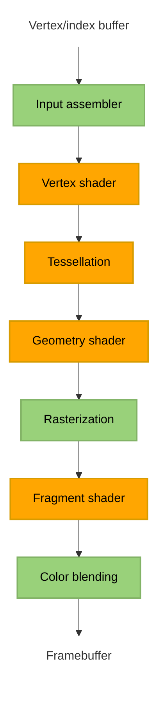

# Chapter 2.1 setting up Vulkan

## General ideas
Program starts with initiating all required Vulkan (and GLFW) objects in the **initVulkan** function, we then enter the **mainloop** function to render frames until the window is closed. After that we need to deallocate the resources we've used in the **cleanup** function.

Vulkan objects can be automatically deallocated using **RAII**, smart pointers, or by implementing automatic resource management with a class's constructor/deconstructor. (Look into **pAllocator** parameter found in almost every function related to creating/destroying Vulkan object)

Vulkan technically doesn't need a window if we're only interested in off-screen rendering. Since we want a window we have to either create one ourselves using system calls or by using a library. This tutorial uses GLFW which is a cross platform library for creating and managing windows (as well as inputs). SDL2 is another option

## VkInstance
### Basics
The **VkInstance** object can be seen as the connection between the application and the Vulkan library. We need to specify details about our application and how it'll be using Vulkan.

Vulkan uses structure to pass information instead of function parameters. These structs almost always have a **pNext** entry. This void pointer can point to another structure for more information. For example **pNext** can point to extension information.

**VkInstance** needs a **VkInstanceCreateInfo** structure to be filled out, specifying optional application information (through a pointer to **VkApplicationInfo**) and required information about what extensions/layers are needed.

Once we have enough information we can create a **VkInstance** object with the **vkCreateInstance** function call. The object creation function parameters in Vulkan are usually:

- Pointer to struct with creation info
- Pointer to custom allocator callbacks (**pAllocator** discussed previously)
- Pointer to the variable that stores the handle to the new object

### Extension support
**vkCreateInstance** can throw error **VK_ERROR_EXTENSION_NOT_PRESENT** if the extensions we requested weren't available. Throwing an error and terminating makes sense if required extensions are missing, but what about optional functionality? This is why it usually makes sense to check for extension support before creating our **VkInstance** object.

The **vkEnumerateInstanceExtensionProperties** function is used to retrieve the number of supported extensions and a corresponding array of **VkExtensionProperties**. This can be used to only add optional extensions to the list of required extensions if they are actually available.

### Cleanup
The VkInstance needs to be deallocated- This is simply done with the **vkDestroyInstance** function (note that its parameters include **pAllocator** discussed previously)

## Validation layers
### Basics
The Vulkan API has almost no error checking by default. This comes from the design goal of minimal driver overhead. Validation layers is how Vulkan incorporates error checking. Validation layers are optional components that hook into Vulkan function calls to apply additional operations. For example:

- Checking the values of parameters against the specification to detect misuse
- Tracking creation and destruction of objects to find resource leaks
- Checking thread safety by tracking the threads that calls originate from
- Logging every call and its parameters to the standard output
- Tracing Vulkan calls for profiling and replaying

Validation layers can be enabled for debug builds and then disabled for release builds, completely removing the overhead once the error checking isn't needed anymore.

There are two types of validation layers, instance and device specific. instance layers check calls related to global Vulkan objects (like instances), device specific layers only check calls related to a specific GPU

### Layer support
Similarly to how supported extensions can be retrieved with **vkEnumerateInstanceExtensionProperties**, **vkEnumerateInstanceLayerProperties** does the same but for layers.

### Message callback
By default the validation layers will print debug messages to standard output. If we want to handle this ourselves we need to provide a pointer to a callback function in our program (similar to **pAllocator** but for error messages instead of memory allocation). This will also allow us to decide what kind of errors we care about.

the callback is set up by creating a debug messenger and giving it a pointer to the callback function. The **VK_EXT_debug_utils** extension gives us the debug messenger object **VkDebugUtilsMessengerEXT**. We create and later destroy **VkDebugUtilsMessengerEXT** with functions **vkCreateDebugUtilsMessengerEXT** and **DestroyDebugUtilsMessengerEXT**. These function aren't automatically loaded since they're extension functions belonging to **VK_EXT_debug_utils**. To call these functions we use proxy functions and call the **vkGetInstanceProcAddr** function to get pointers to the real **DestroyDebugUtilsMessengerEXT**/**vkCreateDebugUtilsMessengerEXT** functions.

The creation of the **VkDebugUtilsMessengerEXT** object needs an already created **VkInstance**, and the **VkDebugUtilsMessengerEXT** object needs to be deallocated before **VkInstance** is. So our debug messenger can't actually debug any issues in the **vkCreateInstance** and **vkDestroyInstance** calls. To fix this we can create a separate **VkDebugUtilsMessengerEXT** object specifically for those two function calls.

## Physical devices
The next step after the Vulkan library has been initialized through a **VkInstance**, is to look for and select graphics cards (we can select multiple).  

The graphics card that we’ll end up selecting will be stored in a **VkPhysicalDevice** handle. The graphics cards are queried through the **vkEnumeratePhysicalDevices** function that enumerates the physical devices accessible to a Vulkan instance.

If we have a **VkPhysicalDevice** handle corresponding to an available graphics card, we can use different functions to query different information about the graphics card.

- **vkGetPhysicalDeviceProperties**: Get basic device properties like the name, type and supported Vulkan version
- **vkGetPhysicalDeviceFeatures**: Get the support for optional features like texture compression, 64 bit floats and
multi viewport rendering (useful for VR)
- **vkGetPhysicalDeviceQueueFamilyProperties**: Get a list of queue families and the number of queues of each queue family.

### Queue families
Almost every operation in Vulkan requires commands to be submitted to the GPU, this is done through queues. The queue families of a GPU are groups of queues that support the same operations. For example, the GPU can have a queue family **A** consisting of **x** queues supporting the same **n** operations, and a different queue family **B** consisting of **y** queues all supporting the same **m** operations different from queue family **A**.

## Logical devices
After we have picked a physical device we need to set up a logical device to interface with it. We need to specify some properties for our logical device and set up what device features and queues we're gonna use. The queues are automatically created along with the logical device, but we need a handle to interface with them, this is done through **VkQueue**.

# Chapter 2.2 Presentation
To make a connection between Vulkan and the window system on your system you need to use the WSI (Window System Integration) extensions. These extensions are used so often that the standard Vulkan loader often includes the extension's functions, so we don't need to explicitly load them like we had for **DestroyDebugUtilsMessengerEXT** and **vkCreateDebugUtilsMessengerEXT**.

## Window surface
The **VK_KHR_surface** extension exposes the **VkSurfaceKHR** object that represents a surface to present images to. **VkSurfaceKHR** needs to be setup right after the **VkInstance** because creation of the surface can influence the device selection. Window surfaces are an entirely optional component in Vulkan, so we went through a bare bones setup without on-screen rendering in **2.1**. This chapter is focused on adding functionality for presenting to the screen.

Creating the **VkSurfaceKHR** object depends on what system you're on. In our case, GLFW will handle any  platform specific implementation so we just call the **glfwCreateWindowSurface** function. Remember that the **VkSurfaceKHR** object needs to be deallocated before the **VkInstance**.

We also need to make sure that our physical device supports presenting to the screen, so we need a physical device with a queue family that supports presenting. Support for presentation isn't checked with the **vkGetPhysicalDeviceQueueFamilyProperties** function, but rather **vkGetPhysicalDeviceSurfaceSupportKHR** that for every queue family queries if presentation support exists. Ideally we'd want to support both graphics operations (that we already needed) and presenting in the same queue family, so that we only need one queue. In the tutorial we don't assume this to be the case so we make another **VkQueue** handle to interface with the presentation queue. The two **VkQueue** handles point to the same underlying queue on my machine.

## Swap chain
Swap chains can be seen as an array of presentable images waiting to be presented to the screen. One image is displayed at a time, but multiple images can be queued for presentation. An application can acquire the use of a presentable image, draw to it, and then present the image back to the swap chain. The general purpose of the swap chain is to synchronize the presentation of images with the refresh rate of the screen.

Before you can create a swap chain you need to check for and enable the device extension for it. Actually, our device having a presentation queue implies that the swap chain extension must be supported, but it's good to be explicit about what functionality we're looking for. After confirming availability, the extension then needs to be enabled during the creation of the logical device.

Next we need to check if the swap chain is compatible with our window surface, we use several functions to query the capabilities of the surface.
- **vkGetPhysicalDeviceSurfaceCapabilitiesKH**
- **vkGetPhysicalDeviceSurfaceFormatsKHR**
- **vkGetPhysicalDeviceSurfacePresentModesKHR**

For this tutorial swap chain support is sufficient if there is at least one supported image
format and one supported presentation mode given our window surface.

Support is now sufficient for creating a swap chain. Since we only required the bare minimum support, there might still be many different modes of varying optimality. So when creating our swapchain we pick our preferred settings out of what is available. After the swap chain has been created we need new **VkImage** handles to the images in the swap chain

## Image views
The **VkImage** object holds the data for the image but it doesn't contain a lot of information on how to read it. To use any **VkImage** in a render pipeline we have to create a **VkImageView** object. The **VkImageView** describes how to access the image and which part of the image to access. So to enable us to use the images in our swap chain, we need to create a **VkImageView** for every one of those images.

# Chapter 2.3 Graphics pipeline basics
## Introduction
The graphics pipeline is a sequence of operations that take the vertices and textures of your meshes all the way to the pixels in the render targets. A simple overview of the sequence looks like

Nodes in green are fixed-function stages, you have some ability to change how operations are performed, but the way they work is mostly predefined. Nodes in orange are programmable, we upload our own code to the graphics card, applying exactly the operations we want.

A short description of each step in the sequence:

**Input assembler** - Collects the raw vertex data from specified buffers and assembles them into primitives.

**Vertex shader** - The **Vertex shader** is run for every vertex and generally applies transformations to turn vertex position from model space to screen space.

**Tessellation (optional)** - Uses tessellation shaders to subdivide geometry based on certain rules to increase the mesh quality.

**Geometry shader (optional)** - The **Geometry shader** is run for every primitive and can discard or output more primitives than came in. This is similar to the tessellation shader, but much more flexible. Example usage is modeling hair/fur defined by lines, the **Geometry shader** is then used to turn the lines into something with a surface (that can be drawn).

**Rasterization** - Converts each primitive into a set of fragments. A fragment is the data necessary to generate a single pixel's worth of a primitive (it will be what the framebuffer is filled with). Fragments that fall outside the screen (or behind other fragments) are discarded.

**Fragment shader** - The **fragment shader** is invoked for every fragment that survives and determines which framebuffer(s) the fragments are written to and with which color and depth values.

**Color blending** - applies operations to different fragments that map to the same pixel in the framebuffer.  Fragments can simply overwrite each other, add up or be mixed based upon transparency. I would guess that this can be used to represent effects like looking through a window.

The graphics pipeline in Vulkan can't (for the most part) be changed after it's created. If you want a different setup you'd have to create a new pipeline. The disadvantage of immutable pipelines is that it necessitates a lot of pipelines that cover all of our use cases. The advantage is that the driver can optimize for the pipelines better, since all the pipelines are known in advance.

## Shader modules
(**Tessellation** and **geometry shaders** aren't covered)

Shader code in vulkan has to be in the bytecode format **SPIR-V**. Writing bytecode manually is tiresome, luckily there are compilers that compiles **GLSL** (high-level shading language created by OpenGL) to **SPIR-V**. We write both our **Vertex shader** and **Fragment shader** in **GLSL** and compile them into **SPIR-V** binaries.

To pass the shaders to a pipeline, we have to load the binaries and wrap them into **VkShaderModule** objects. We also need to give information about what pipeline stage a **VkShaderModule** object belongs to, which is done through the **VkPipelineShaderStageCreateInfo** struct (**pSpecializationInfo** member in the struct is skipped but worth remembering). 

## Fixed functions
The other stages of the pipeline aren't programmable, but we still need to configure the state of these stages along with anything else that needs to be configured.

### Setting state through **CreateInfo** structs
Setting the state of the pipeline involves configuring a lot of **CreateInfo** structs,

**Vertex input state**: Specifies the format
of the vertex data that will be passed to the vertex shader, uses the **VkPipelineVertexInputStateCreateInfo** struct.

**Input assembly state**: Specifies what kind of geometry will be drawn from the vertices and if primitive restart (?) should be enabled, uses the **VkPipelineInputAssemblyStateCreateInfo** struct.

**Viewport and scissor state**: Specifies the region of the framebuffer that the output will
be rendered to, uses the **VkPipelineViewportStateCreateInfo** struct.

**Rasterizer state**: Specify how the rasterizer turns geometry that is shaped by the vertices from the vertex shader into fragments to be colored by the fragment shader, uses the **VkPipelineRasterizationStateCreateInfo** struct.

**Multisampling state**: Configure multisampling. Uses the **VkPipelineMultisampleStateCreateInfo** struct. (will revisit multisampling later).

**Depth and stencil testing state**: configure
the depth and stencil tests. Uses the  **VkPipelineDepthStencilStateCreateInfo** structs. (will revisit Depth and stencil testing later).

**Color blending state**: Specifies how color blending will be done, uses the **VkPipelineColorBlendStateCreateInfo** struct.

### Dynamic state
While most of the pipeline's state is baked into an immutable pipeline state object, there is a limited amount of the state that can be changed without recreating the pipeline. Examples are,

- Size of the viewport
- Line width
- Blend constants

You either configure these and bake them into the immutable pipeline state object, or set up the use of dynamic state. If dynamic state is used for the size of the viewport, it'll cause the configuration of the viewport size to be ignored during pipeline creation, and you'll need to specify this data during drawing time instead. Using dynamic state can result in a more flexible setup and is common for viewport and scissor state. Setting up dynamic state uses **VkPipelineDynamicStateCreateInfo**.

## Pipeline layout
Similar to how dynamic state allows us to change some state at draw time, we can use uniform values in shaders to alter the behavior of shaders without having to recreate them. The uniform values (and push values) need to be specified during pipeline creation by creating a **VkPipelineLayout** object. Even if we aren't using this functionality, a **VkPipelineLayout** object is still required for creating a graphics pipeline so we need to at least create an empty pipeline layout. We'll refer to the the pipeline layout from other functions later, so we create a class member to store it.

## Render pass
When rendering, we render to a framebuffer, containing a set of attachments. There are different types of attachments like color and depth attachments, each represented by a **VkImageView** object. For example, a framebuffer that has both a color and depth attachments (so 2 **VkImageView** objects) can be used for basic 3D rendering.

Before we can use the pipline we need to define the behavior and lifecycle of the attachments during a rendering process, this is the role of the **VkRenderPass** object. We need to specify,

- how many attachments, and of what types?
- what to do with data in attachments before/after rendering
- Initial/Final layout
- subpasses (only quickly mentioned but seems more important as project grows)

After these have been specified we can create our **VkRenderPass** object.

## Conclusion (creating pipeline)
We're now ready to create our graphics pipeline. We just need to combine all of the structures and objects from this chapter (Chapter 2.3 Graphics pipeline basics), together they fully define the functionality of the graphics pipeline. Things of note for the creation process of the **VkPipeline** object,

- deriving from existing pipelines (it is less expensive to set up pipelines when they have much functionality in common with an existing pipeline and switching between pipelines from the same parent can also be done quicker.)
- **vkCreateGraphicsPipelines** has more parameters compared to usual object creation functions in Vulkan. This is partially because it's  designed to take multiple **VkGraphicsPipelineCreateInfo** objects and create multiple **VkPipeline** objects in a single call. additionally the pipeline cache (not covered yet).

# Chapter 2.4 Drawing

## Framebuffers
It has been mentioned that the render targets in Vulkan are Framebuffers, each consisting of a one or more attachments represented by **VkImageView** objects. We've setup the render pass to expect a single framebuffer with the same format as the swap chain images, and to only expect a framebuffer with one color attachment. The image we have to use for a particular render pass depends on which image the swap chain returns when we retrieve one for presentation. This means that we need to create a framebuffer for every image in the swap chain so we can render to the one that corresponds to the retrieved image.

Every framebuffer is a **VkFramebuffer** object, so we'll make an array of them (similar to how we created **VkImageView** objects). For creation of each **VkFramebuffer** object we need to specify which render pass it has to be compatible with. Every attachments needs to be specified, each with a corresponding **VkImageView** object. Lastly we need to define the dimensions of the framebuffer.

## Command buffers
In Vulkan, all GPU commands (with a few exceptions) have to go through a **VkCommandBuffer** object. Command buffers creation is done through the use of a **VkCommandPool** object. One command pool is designed to be used by a single thread and manages the allocation/deallocation of command buffers within the same queue family. Creating a **VkCommandPool** is simple, just specify the queue family index and any additional flags. Once the **VkCommandPool** has been created, **VkCommandBuffer** objects can easily be made.

with a **VkCommandBuffer** object we can record a sequence of commands. For example a basic draw sequence
- Begin render pass
- Bind to pipeline
- Draw to Image
- End render pass
When the commands have been recorded into the command buffer, they can be submitted to the  queue for execution.

## Rendering and presentation
Now everything is setup to implement a **drawFrame** function. The basic steps for the **drawFrame** are

- Wait for previous frame to finish
- Acquire an image from the swap chain
- Record a command buffer which draws the scene onto that image
- Submit the recorded command buffer
- Present the swap chain image

This implementation is basic suboptimal. We'll expand on the **drawFrame** later.

### Synchronization
Operations on the GPU in vulkan are automatically parallelized to a large extent. Loosely speaking, once we submit a command buffer the GPU will execute a lot of operations in parallel, without any consideration for synchronization. This is powerful because it allows the GPU to focus on what it does best, but a consequence is that we have to implement synchronization where an explicit order is important (for example, where results from some operations depend on other (potentially unfinished) operations).

For our basic implementation of the **drawFrame** function there are 3 events that need to be synchronized,

- Acquire an image from the swap chain
- Execute commands that draw onto the acquired image
- Present that image to the screen for presentation, returning it to the
swapchain

Each of these events are set in motion using a single function call, but they're all executed asynchronously on the GPU. The function calls themselves will return almost immediately, before the operations are actually finished on the GPU. Since each of our events depend on the previous one finishing, we need some way of achieving our desired ordering, luckily Vulkan provides primitives for that exact purpose. Similarly to how semaphores are used to synchronize multithreaded applications, Vulkan provides primitives **VkSemaphore** and **VkFence** for synchronization. **VkSemaphore** is used to synchronize work between GPU commands (for example, synchronizing execution of two GPU operations) and **VkFence** is used to synchronize between GPU and CPU (for example, when the CPU needs to know whether a set of GPU operations has completed). **VkFence** actually does block host execution so use it sparingly.

### Subpass dependencies
Even though we only use 1 subpass, the operations right before and right after our subpass count as implicit “subpasses” and require some implementation to synchronize. I'll have to read more about subpass dependency, the tutorial doesn't go into enough details.

### Presentation
Adding everything mentioned in this section together, we're finally able to draw our triangle.

## Frames in flight
One of the flaws with our current basic drawing function, is that we wait for the previous frame to finish before we start rendering the next. To get rid of this unnecesssary idling we can allow multiple frames to be *in-flight* at once. You don't want to many frames *in-flight* because then the CPU could get ahead of the GPU, adding frames of latency.

Adding this functionality isn't to complicated, you just need to keep track of the current frame, and for each of these frames, duplicate all the resources that are accessed/modified during rendering. Each frame needs its own, Command buffer, semaphores and fence. 

# 2.5 Swap chain recreation

## Introduction
The application can now successfully draw a triangle, but before moving on to the next chapter lets make it so that our application can handle changes to the surface. Right now, it's possible for the window surface to change such that the swap chain is no longer compatible with it (an example of this would be minimizing the window). To fix this, we need to catch events that change the window surface and recreate the swap chain.

## Recreating the swap chain
First let's implement a function for recreating the swap chain. Not only do we need to recreate the swap chain, but we also need to recreate objects that depend on either the swap chain or the window size. This includes the **VkSwapchainKHR**, **VkImageView**, and **VkFramebuffer** objects (**VkRenderPass** would also need to be recreated if the swapchain image format changed, but we skip it. Unclear if this would also necessitate recreation of the VkPipeline). The general outline of a **recreateSwapChain** function is

1. Wait if resources are still being used.
2. Clean up objects before recreating them
3. Recreate objects
   
("A disadvantage of this approach is that we need to stop all rendering before creating a new swap chain. It is possible to create a new swap chain while drawing commands on an image from the old swap chain are still in-flight. You need to pass the previous swap chain to the oldSwapChain field in the VkSwapchainCreateInfoKHR struct and destroy the old swap chain as soon as you’ve finished using it.")

## Suboptimal or out-of-date swap chain
The next step is to figure out when to actually recreate the swap chain. Vulkan usually tells us that the swap chain is no longer adequate during presentation. The return values of **vkAcquireNextImageKHR** and **vkQueuePresentKHR** can indicate (among other things) whether or not the swap chain is still compatible. For this there are 2 relevant return values.

- **VK_SUBOPTIMAL_KHR**: The swap chain has become incompatible with the surface and can no longer be used for rendering.
- **VK_ERROR_OUT_OF_DATE_KHR**: The swap chain can still be used to successfully present to the surface, but the surface properties are no longer matched exactly.

After a **vkAcquireNextImageKHR** call, you could recreate the swap chain for both **VK_SUBOPTIMAL_KHR** and **VK_ERROR_OUT_OF_DATE_KHR** return values. However, you can still proceed normally with a suboptimal swap chain. Since the next image has already been acquired it can make sense to only recreate the swap chain when necessary (i.e when getting **VK_ERROR_OUT_OF_DATE_KHR**).

After a **vkQueuePresentKHR** call we don't need to worry about already acquiring an image, so we can simply recreate the swap chain if we get either **VK_SUBOPTIMAL_KHR** or **VK_ERROR_OUT_OF_DATE_KHR**.

## Fixing a deadlock
A very important thing you might notice is that currently swap chain recreation can cause a deadlock. When **vkAcquireNextImageKHR** returns **VK_ERROR_OUT_OF_DATE_KHR** we recreate the swap chain and return from **drawFrame**. **vkQueueSubmit** is never called and consequently the current frame's **VkFence** will never get signaled, causing the **vkWaitForFences** call at the start of the next **drawFrame** to wait forever. Luckily there is a simple fix, simply wait to reset the fence until we know whether or not we'll be continue through **drawFrame**.

## Handling resizes explicitly
Ideally, all drivers and platforms would trigger VK_ERROR_OUT_OF_DATE_KHR automatically after a window resize, but this is not a guarantee. Because of this we'll handle resizes explicitly. This involves using the **glfwSetFramebufferSizeCallback** function to setup a callback function that's gets called whenever our **GLFWwindow** is resized.

("It is important to do this after vkQueuePresentKHR to ensure that the semaphores are in a consistent state, otherwise a signaled semaphore may never be properly waited upon.")